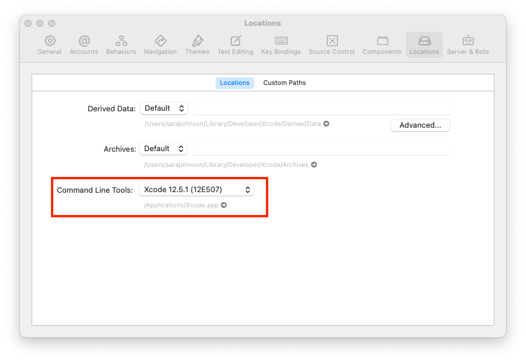

# fetch-fbook
Repository for automated Android Facebook tests

## Introduction

This repository is used for automated testing for the Android Facebook app. The folder structure of this repository is primarily based on the structure used by the [Selenium Cucumber gem](https://github.com/selenium-cucumber/selenium-cucumber-ruby).

## Setup

### `zsh` Profile
The default shell in Mac OS is `zsh`, but gitlab pipelines expect to use `bash`. For this reason, these instructions will have you set up environment variables, etc. in a `~/.bash_profile` file, and will set up a `~/.zshrc` profile to reference the bash profile.

To set up a `zsh` profile:

1. Create an empty profile file and open it.

         $ touch ~/.zshrc
         $ open ~/.zshrc

2. Add the following to the file and save:

         if [ -f ~/.bash_profile ] ; then
            . ~/.bash_profile
         fi

After this, any `zsh` shell terminals will use the settings specified in `~/.bash_profile`.

### Xcode
Xcode command line tools are needed by Homebrew to download some of the required packages. It is recommended that you [install the full Xcode app from the App Store](https://apps.apple.com/us/app/xcode/id497799835?mt=12).

After installing Xcode, launch the app, then go to the `Xcode` menu, select `Preferences...`, then select the `Locations` tab to ensure that the Command Line Tools are selected.

### Homebrew
Homebrew is a package manager for Mac OS and Linux.

To install, go to [Homebrew's webpage](https://brew.sh/) and follow their installation instructions.

Once installed, install Cask.

        $ brew tap homebrew/cask

